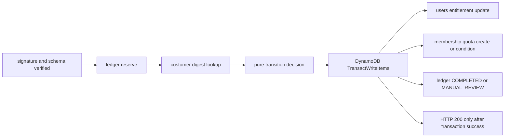

# fincode Webhook AWS Adapter design

Status: design only / AWS disconnected / implementation not authorized
Recorded: 2026-07-30
Canonical for: AWS adapter, storage, transaction, IAM, and staging rollout design

## 1. Scope and non-goals

This document maps the reviewed local fincode Webhook foundation to the existing
white-label staging architecture without connecting to AWS or fincode. It fixes
the v1 business policy, storage boundaries, atomic transaction contract,
least-privilege IAM, safe observability, and explicit rollout gates.

This phase does **not** implement a Lambda handler, AWS SDK repository, DynamoDB
table, IAM role, CloudFormation resource, Secret reference, Webhook endpoint,
entitlement mutation, fincode registration, or production configuration.

The existing contract and HTTP behavior remain canonical in:

- `docs/FINCODE_WEBHOOK_CONTRACT.md`
- `docs/FINCODE_WEBHOOK_HTTP_ADAPTER.md`
- `src/server/fincode/`

## 2. Existing repository inventory

### 2.1 Existing staging stack pattern

`infrastructure/reading-staging/template.json` is the reusable CloudFormation
pattern. It uses generated physical names, `PAY_PER_REQUEST`, encryption,
resource tags, retained data resources, explicit Lambda log groups, Node.js 22,
and scoped table ARNs. No fincode resource exists in that template today.

Existing DynamoDB logical resources:

| Logical ID | Key | TTL | PITR | SSE | Relevant use |
| --- | --- | --- | --- | --- | --- |
| `ReadingUsersTable` | `user_id` | none | on | on | membership source of truth |
| `ReadingHistoryTable` | `user_id` + `history_id` | none | on | user-owned completed readings |
| `ReadingIdempotencyTable` | `request_ref` | `expires_at` | on | on | reading request idempotency only |
| `ReadingRateLimitTable` | `rate_limit_ref` | `expires_at` | on | on | short-window rate/concurrency only |
| `ReadingDeepQuotaTable` | `quota_ref` | `expires_at` | on | on | premium deep monthly use, limit 3 |
| `ReadingJobsTable` | `job_ref` | `expires_at` | off | on | asynchronous reading jobs |

The existing reading idempotency and rate tables must not be reused as a
payment-event ledger. Their keys, lifecycle, and state machines have different
authority and retention.

### 2.2 Existing users membership fields

`src/server/users/dynamoUserRepository.ts` confirms `user_id` as the users key
and reads only:

- `plan`
- `subscription_status`
- `deep_enabled`
- `monthly_voice_limit`
- `monthly_voice_used`
- `extra_voice_remaining`
- `cancel_at_period_end`
- `current_period_end`

`src/lib/membershipEntitlements.ts` grants deep only for
`premium + active + deep_enabled=true`. Monthly voice is available only to an
active premium membership, while `extra_voice_remaining` remains independent.
Legacy Stripe fields are not authority.

### 2.3 Existing quota behavior

- `ReadingDeepQuotaTable` uses a digest `quota_ref`, JST `YYYY-MM` period key,
  a fixed limit of 3, versioned conditional writes, active reservations, and a
  final atomic consume/release transaction.
- `ReadingRateLimitTable` uses bounded windows of at most 86,400 seconds. It is
  a protective rate/concurrency control, not the contractual monthly light
  allowance.
- No implemented table or users field represents monthly light usage and limit
  5/20. This must be added or otherwise explicitly resolved before paid light
  enforcement is complete.
- Current `monthly_voice_*` users fields exist, but the separate voice-credit
  design says direct users-counter mutation is not the long-term usage ledger.
  v1 may update the membership limit only; usage migration remains separate.

### 2.4 Reusable helpers

- normalized tier/status handling: `membershipEntitlements.ts`
- JST month key: `getJstPeriodKey()`
- digest/HMAC reference patterns: reading rate/deep quota helpers
- conditional transaction patterns: `dynamoAsyncReadingPersistence.ts`
- fixed safe errors and structured allow-list logs: existing server foundation
- strict HTTP adapter, signature-first validation, semantic event digest, and
  payload fingerprint: `src/server/fincode/`

## 3. v1 entitlement policy

| Membership state | plan | subscription_status | deep_enabled | light/month | deep/month | monthly_voice_limit |
| --- | --- | --- | ---: | ---: | ---: | ---: |
| active light | `light` | `active` | false | 5 | 0 | 3 |
| active premium | `premium` | `active` | true | 20 | 3 | 10 |
| free/unsubscribed | `free` | `inactive` | false | 0 | 0 | 0 |

Plan and reading mode remain separate. Premium defaults to light; deep is an
explicit mode subject to the existing deep quota.

Cancellation is period-end. Existing reading text and generated audio remain
user assets. New paid generation stops only when the trusted contract period
has ended. The reviewed subscription Webhook payload does not establish a
canonical `current_period_end`; it must not be inferred from `process_date`,
`start_date`, local month boundaries, or delivery time.

`INCOMPLETE` never grants a new entitlement or period allowance. For an
existing active contract it records a safe billing/manual-review state without
immediate revocation or rollover. Plan changes are not automatic in v1 and are
classified `PLAN_CHANGE_REQUIRES_MANUAL_REVIEW` with zero entitlement mutation.

Refund, chargeback, `payments.card.*`, and `recurring.card.batch` remain outside
the allow-list and outside v1.

## 4. Event to transition to mutation matrix

`retry=yes` means fincode will receive a non-success response and may redeliver.
`period trusted` means a separately verified source supplies an authoritative
period identity and end; the Webhook payload alone is insufficient.

| Event/case | HTTP | retry | ledger final state | entitlement mutation | quota mutation | audit code | manual action | atomicity condition |
| --- | ---: | --- | --- | --- | --- | --- | --- | --- |
| regist ACTIVE light, new mapped contract, period trusted | 200 | no | COMPLETED | set active light policy | create light period allowance; voice limit 3 | ENTITLEMENT_APPLIED | none | users + quota + ledger in one transaction |
| regist ACTIVE premium, new mapped contract, period trusted | 200 | no | COMPLETED | set active premium policy | light allowance 20; deep remains existing quota model; voice limit 10 | ENTITLEMENT_APPLIED | none | users + quota + ledger in one transaction |
| update ACTIVE same plan/same period | 200 | no | COMPLETED | no-op or reconcile exact policy | **do not reset used counters** | WEBHOOK_COMPLETED | none | condition on plan, period, event digest |
| update ACTIVE same plan/new trusted period | 200 | no | COMPLETED | preserve active policy | create next period item; never overwrite prior used value | ENTITLEMENT_APPLIED | none | period item absent + users + ledger transaction |
| ACTIVE but period is not authoritative | 503 | yes | FAILED_RETRYABLE | none | none | TRANSACTION_FAILED_RETRYABLE | establish period source | no success before period identity exists |
| update INCOMPLETE, new/free user | 200 | no | MANUAL_REVIEW | none; preserve free | none | INCOMPLETE_RECORDED | inspect billing | manual-review state + ledger completed atomically |
| update INCOMPLETE, existing active user | 200 | no | MANUAL_REVIEW | do not revoke | no replenishment/rollover | INCOMPLETE_RECORDED | resolve billing status | manual-review marker + ledger atomically |
| delete CANCELED before trusted period end | 200 | no | MANUAL_REVIEW | set cancel-at-period-end only | none | WEBHOOK_COMPLETED | expiry process required | users marker + ledger transaction |
| delete CANCELED at/after trusted period end | 200 | no | COMPLETED | set free/inactive/deep false; preserve assets and extra credits | no new monthly allowance | ENTITLEMENT_APPLIED | none | trusted end condition + users + ledger transaction |
| CANCELED without trusted period end | 200 | no | MANUAL_REVIEW | no immediate revocation | none | PLAN_CHANGE_MANUAL_REVIEW | future lookup/scheduler | record review state; never infer expiry |
| unknown plan | 400 | yes | REJECTED_PERMANENT or none | none | none | PLAN_NOT_ALLOWED | fix configuration | no mutation |
| same subscription with plan change | 200 | no | MANUAL_REVIEW | none | none | PLAN_CHANGE_MANUAL_REVIEW | operator decision | review state + ledger atomically |
| valid customer reference but mapping missing | 503 | yes | FAILED_RETRYABLE | none | none | CUSTOMER_MAPPING_MISSING | repair mapping | reserve may fail/release; no completion |
| duplicate COMPLETED, same fingerprint | 200 | no | COMPLETED unchanged | none | none | DUPLICATE_COMPLETED | none | strong read verifies fingerprint/state |
| duplicate RESERVED/in progress | 503 | yes | RESERVED unchanged | none | none | DUPLICATE_IN_PROGRESS | inspect only if stale | no second transaction |
| same digest, different fingerprint | 409 | yes | existing unchanged/MANUAL_REVIEW | none | none | EVENT_CONFLICT | investigate | fingerprint condition prevents mutation |
| ledger unavailable | 503 | yes | unknown/not reserved | none | none | TRANSACTION_FAILED_RETRYABLE | infrastructure check | no customer/write path |
| customer repository unavailable | 503 | yes | FAILED_RETRYABLE | none | none | CUSTOMER_MAPPING_MISSING | infrastructure check | no users/quota mutation |
| entitlement transaction conditional failure | 503 | yes | RESERVED or FAILED_RETRYABLE | none committed | none committed | TRANSACTION_FAILED_RETRYABLE | reconcile state | all-or-nothing transaction |
| Secret unavailable | 503 | yes | none | none | none | TRANSACTION_FAILED_RETRYABLE | restore Secret access | before body parse or repository access |
| feature flag disabled | 503 | yes | none | none | none | WEBHOOK_DISABLED | explicit GO required | first processing step |

Permanent 4xx deliveries can repeat up to six times. Each repeat must remain
side-effect free. `MANUAL_REVIEW` is a safe terminal acknowledgement only after
that classification is stored without changing entitlements.

## 5. Customer mapping

Add a dedicated table; do not scan users and do not map by email.

| Attribute | Type/rule |
| --- | --- |
| `customer_ref_digest` | PK, SHA-256 of the complete opaque reference |
| `internal_user_id` | existing users PK; never sent to fincode or logs |
| `environment` | exact `staging` or `production` |
| `mapping_status` | `ACTIVE`, `DISABLED`, or `MANUAL_REVIEW` |
| `version` | positive integer for conditional lifecycle changes |
| `created_at`, `updated_at` | ISO timestamps |

No sort key or GSI is required for Webhook lookup. The digest must resolve to
exactly one item; table PK uniqueness provides this invariant. Repository output
is the internal reference only after environment/status validation.

Opaque references are created server-side with CSPRNG:
`stg_<base64url 32 random bytes>` or `prd_<base64url 32 random bytes>`. Neither
raw reference nor its random component is stored in this table. A missing valid
mapping is retryable 503, not a permanent 400. Disabled or inconsistent mapping
is manual review and no users-table scan is allowed.

## 6. Webhook ledger schema

Add a dedicated table with PK `event_digest` and no sort key.

| Attribute | Rule |
| --- | --- |
| `event_digest` | 64-hex PK |
| `fingerprint` | 64-hex canonical payload fingerprint |
| `environment` | exact boundary |
| `event_type`, `status` | normalized allow-list values |
| `processing_state` | RESERVED, COMPLETED, FAILED_RETRYABLE, MANUAL_REVIEW, optional REJECTED_PERMANENT |
| `result_code` | fixed allow-list only |
| `attempt_count`, `version` | non-negative/positive integers |
| `created_at`, `updated_at` | ISO timestamps |
| `expires_at` | DynamoDB TTL epoch seconds |
| `correlation_digest`, optional `mapped_user_digest` | digest only |

Configuration is mandatory:

```text
FINCODE_WEBHOOK_LEDGER_RETENTION_DAYS=180
minimum=30, maximum=730, integer only
```

There is no default. TTL is calculated from first reservation and is not
extended by duplicate delivery. After TTL deletion, an old provider delivery
cannot be distinguished from a new event; the receiver must return 503/manual
review when its provider timestamp falls outside the accepted operational
window rather than silently reapply an entitlement. The exact accepted-age
policy needs implementation review before enablement.

Table design follows the existing pattern: `PAY_PER_REQUEST`, SSE on, PITR on,
`DeletionPolicy` and `UpdateReplacePolicy` Retain, and Project/Environment/
Component/ManagedBy tags. Staging and production use different stacks/tables.

## 7. Entitlement and quota schema mapping

Webhook may update only reviewed membership authority fields in `ReadingUsersTable`:

- `plan`, `subscription_status`, `deep_enabled`
- `monthly_voice_limit`
- `cancel_at_period_end`, `current_period_end` only from a trusted period source
- proposed `membership_contract_ref_digest`, `membership_period_key`,
  `membership_version`, `last_membership_event_digest`, and safe billing state

It must not change password/authentication fields, `extra_voice_remaining`,
history, prior generated assets, Stripe legacy fields, or arbitrary user data.

The proposed fields do not yet exist as an implemented contract and require a
separate schema/reader review before coding.

`ReadingDeepQuotaTable` remains the canonical deep-use store and already limits
premium deep to three per JST month. Webhook must not reset its `used` value.
Deactivation is enforced by the existing users ConditionCheck.

The monthly light allowance has no current durable schema. Add a dedicated
membership usage table (provisional logical name
`FincodeMembershipQuotaTable`) keyed by a digest of user + authoritative period
+ usage type. Minimum item fields are `quota_ref`, `period_key`, `usage_type`,
`plan`, `limit`, `used`, `version`, timestamps, and TTL. Webhook may create a new
period item with `used=0` only under `attribute_not_exists(quota_ref)`; it must
never overwrite an existing counter. The reading acceptance path must later
consume this quota atomically. Until that implementation exists, the stated
monthly light limits are policy only and paid-light production release is not
ready.

## 8. Atomic transaction and Port contract

### 8.1 Required flow



The completion transaction contains:

1. ledger condition: matching digest/fingerprint, state RESERVED, expected version
2. users condition: mapped user exists, expected membership version/plan/period
3. users update when the decision permits mutation
4. quota put/update condition when a trusted new period is granted
5. ledger update to COMPLETED or MANUAL_REVIEW

Maximum normal item count is three. Deep usage is not granted/consumed by this
Webhook transaction. A transaction failure commits nothing and returns 503.
Use a deterministic client request token derived from event digest and action
domain, never from raw provider identifiers.

### 8.2 Current Port judgment

**PORT_CONTRACT_REVISED**

The local contract now exposes `FincodeWebhookAtomicCompletionPort` as the only
success-completion path. Independent `entitlementWriter.applyDecision()` and
`ledger.complete()` contracts have been removed. Ledger reserve and retryable
failure recording remain separate pre-/failure-path operations; neither can
produce a successful acknowledgement for a newly reserved event.

The implemented request expands the minimum sketch below with a raw-ID-free
normalized event summary, reviewed plan/period/entitlement/quota/billing
mutations, fixed result code, digest-only correlation, validated retention, and
completion time:

```ts
interface FincodeWebhookAtomicCompletionPort {
  applyAndComplete(input: {
    semanticEventKey: string;
    payloadFingerprint: string;
    expectedLedgerState: "RESERVED";
    userReference: string;
    completionPlan: ReviewedFincodeAtomicCompletionPlan;
  }): Promise<
    | "COMPLETED"
    | "ALREADY_COMPLETED"
    | "CONDITIONAL_CONFLICT"
    | "UNAVAILABLE"
    | "RETRYABLE_FAILURE"
  >;
}
```

The orchestrator calls this Port exactly once after reserve, mapping, transition,
and reviewed-plan availability. It returns 200 only after `COMPLETED` or
`ALREADY_COMPLETED`; unavailable, retryable, thrown, unknown, or missing
completion behavior fails closed. Customer-missing is retryable 503. The future
atomic adapter owns `TransactWriteItems`; no caller can acknowledge between its
writes.

## 9. Lambda adapter

Proposed staging-only function configuration:

| Setting | Design |
| --- | --- |
| runtime | Node.js 22 |
| architecture | arm64 if all bundled dependencies pass; otherwise existing default |
| memory | 256 MiB initial |
| timeout | 3 seconds |
| reserved concurrency | 2 in staging; explicit bounded value for production later |
| DLQ/SQS | none for v1 synchronous truth path |
| retries | API Gateway/fincode delivery contract only; SDK maxAttempts 1 |

Handler responsibilities are limited to config validation, cached Secret
lookup, conversion of the HTTP API v2 event to the existing structural adapter,
orchestrator invocation, fixed response return, safe metric/audit emission, and
deadline enforcement. It does not call fincode APIs.

Secret retrieval and all mandatory configuration occur before body parsing.
Because three seconds is a provider deadline assumption, the handler should use
an internal budget below the Lambda timeout and return 503 before exhaustion.
Cold-start and transaction latency must be measured in staging before any GO.

No asynchronous acknowledgement is allowed: queueing work and returning 200
before entitlement + ledger completion would break the receipt contract.

## 10. API Gateway

- Dedicated staging HTTP API route, proposed `POST /fincode/webhook`
- payload format v2.0; no path rewrite
- public endpoint with no session/Bearer authorization
- TLS through API Gateway
- no CORS response or OPTIONS route
- body size is still enforced by the local 64 KiB decoded limit
- stage is an explicit environment parameter, never production by default
- throttling is bounded at API/stage level; WAF is a later GO unless threat and
  cost review justify it for v1
- access logs omit body, headers, query values, raw IDs, and signature

The endpoint URL, API ID, stage, and raw identifiers never appear in committed
design evidence.

## 11. Secret design

Use a dedicated Secrets Manager secret per environment. The value is the
Webhook shared signature, not a fincode API key. Lambda receives only a secret
identifier/dynamic reference, never the plaintext in CloudFormation or env.

- retrieve with `GetSecretValue` at cold start after environment validation
- cache only in the Lambda process; never place it in `process.env`
- do not log value, length, hash, prefix/suffix, response metadata, or full ARN
- missing, empty, malformed, inaccessible, or rotation-conflict state returns 503
- never parse body when expected signature retrieval failed
- rotation uses an explicit two-step staging test and rollback; do not accept
  two signatures unless a separately reviewed bounded rotation contract exists
- staging and production secrets, roles, functions, and endpoints are distinct

## 12. IAM matrix

| Action | Resource | Reason | Phase | Decision |
| --- | --- | --- | --- | --- |
| `dynamodb:GetItem` | exact ledger and customer mapping table ARNs | reserve/duplicate and mapping read | runtime | allow |
| `dynamodb:PutItem` | exact ledger table ARN | conditional initial reserve | runtime | allow |
| `dynamodb:UpdateItem` | exact ledger table ARN | retryable/manual state outside completion transaction | runtime | allow |
| `dynamodb:TransactWriteItems` | exact ledger, users, and membership quota table ARNs | atomic entitlement + quota + completion | runtime | allow |
| `secretsmanager:GetSecretValue` | exact environment-specific signature secret ARN | signature verification | runtime | allow |
| log stream/event actions | exact function log group/stream where resource scoping is supported | safe audit logs | runtime | allow |
| `dynamodb:Query`, `Scan`, `BatchGetItem`, `BatchWriteItem` | any | digest PKs require GetItem only | all | forbid |
| table create/delete/update | any | runtime cannot administer schema | all | forbid |
| IAM actions | any | no runtime IAM administration | all | forbid |
| Lambda invoke | any | no downstream function | all | forbid |
| SQS actions | any | synchronous v1 | all | forbid |
| fincode outbound network/API permissions | any | receiver does not call provider | all | forbid |
| production table/secret ARNs in staging role | any | environment isolation | all | forbid |

`TransactWriteItems` has no separate `ConditionCheckItem` IAM action; its table
resources are enumerated on `dynamodb:TransactWriteItems`. Avoid `Resource:"*"`
except unavoidable CloudWatch Logs create-group handling; preferably create the
log group in IaC so runtime only writes to the exact group.

## 13. Feature flags and configuration

All values are required and fail closed unless explicitly marked:

```text
FINCODE_WEBHOOK_ENABLED=false
FINCODE_WEBHOOK_ENVIRONMENT=staging
FINCODE_WEBHOOK_LEDGER_RETENTION_DAYS=180
FINCODE_WEBHOOK_ALLOWED_SHOP_DIGESTS=<non-secret digest allow-list>
FINCODE_WEBHOOK_ALLOWED_PLAN_MAPPING=<reviewed environment mapping or secret reference>
FINCODE_WEBHOOK_SIGNATURE_SECRET_ID=<environment-specific identifier>
FINCODE_WEBHOOK_LEDGER_TABLE=<Ref>
FINCODE_CUSTOMER_MAPPING_TABLE=<Ref>
FINCODE_MEMBERSHIP_QUOTA_TABLE=<Ref>
USERS_TABLE_NAME=<existing Ref>
```

Do not add deep/voice table env vars unless the final transaction really writes
those tables. Raw shop and plan IDs are needed for exact validation in memory;
if configuration uses digests, the schema validator must compare canonical
digests without weakening the existing allow-list. No config value defaults to
production, and an unknown environment is invalid.

## 14. Audit and metrics

Reuse the local audit allow-list and map outcomes to fixed codes. Additional
codes may be added only as fixed enums. Allowed fields are request correlation,
event digest, normalized event/status, environment, replay classification,
transition classification, response class, duration, and fixed result code.

Metrics are derived from structured logs/EMF without granting
`cloudwatch:PutMetricData`: request count, 2xx/4xx/5xx, signature denial,
duplicate, conflict, retryable failure, transaction failure, manual review,
duration, and cold start. Dimensions are only environment, fixed outcome, and
fixed event class. Raw IDs and exception text are forbidden.

Alarms for staging design review: sustained 5xx, any conflict, transaction
failure, manual-review growth, duration near internal budget, Lambda errors/
throttles, and no-data only when a planned test window expects traffic.

## 15. Failure matrix

| Failure | Response | Side effect | Safe record |
| --- | ---: | --- | --- |
| disabled/config invalid/Secret unavailable | 503 receive 1 | none | fixed audit only |
| method/content/body/schema/env invalid | 400 receive 1 | none | fixed denial audit |
| signature missing/ambiguous/mismatch | 401 receive 1 | none | fixed denial audit |
| reserve unavailable | 503 receive 1 | none/unknown reserve reconciled by strong read | digest audit |
| completed duplicate | 200 receive 0 | none | duplicate audit |
| in-progress duplicate | 503 receive 1 | none | duplicate audit |
| fingerprint conflict | 409 receive 1 | none | conflict/manual review |
| mapping missing/unavailable | 503 receive 1 | none | retryable state/audit |
| plan/period requires review | 200 only after MANUAL_REVIEW is committed | no entitlement mutation | terminal review record |
| atomic transaction condition fails | 503 receive 1 | transaction commits nothing | retryable audit |
| SDK result ambiguous | 503 unless strong consistent ledger read proves COMPLETED fingerprint match | no second mutation | digest audit |
| deadline budget exhausted | 503 receive 1 | no success acknowledgement | timeout audit |

## 16. Test design for implementation

- pure unit and response contract tests
- AWS-command-shape tests with fake sender; no AWS connection
- DynamoDB Local or deterministic transaction simulator
- same event delivered six times
- duplicate completed/in-progress and fingerprint conflict
- inability to construct writer-success/ledger-failure or reverse partial states
- all transaction cancellation reasons mapped to fixed safe results
- customer digest lookup, missing/disabled/collision cases
- retention days 30/180/730 and invalid/missing values
- TTL stale-delivery policy
- staging/production reference mismatch
- exact ACTIVE light/premium fields
- same-period update does not reset light/deep/voice counters
- trusted new-period idempotency
- INCOMPLETE grants nothing
- period-end cancel and unknown-period manual review
- plan change mutates nothing
- Secret failure occurs before JSON parse
- duplicated signature headers rejected
- raw body/headers/provider IDs/AWS exceptions absent from logs
- SDK `maxAttempts:1`
- Node.js 22, full regression, Astro build, secret scan, diff check

## 17. Staging rollout and GO boundaries

Each numbered GO requires separate human authorization; later approval is not
implied by an earlier one.

1. **Implementation GO:** Port revision, adapters, mock tests, and IaC draft.
2. **Review-role GO:** design a temporary read-only/least-privilege reviewer; no creation yet.
3. **Change Set creation GO:** verify account/profile/region/stack and create staging-only Change Set.
4. **Change Set execution GO:** only reviewed additions, no replacement/removal, flag false.
5. **Inventory GO:** stack status, ownership, drift, tags, IAM, endpoint existence; no request.
6. **fincode test registration GO:** test-mode dashboard only, dedicated endpoint/events.
7. **test signature GO:** create/configure a staging-only signature without exposing it.
8. **enable GO:** turn on the single Webhook flag with mutation policy still reviewed.
9. **delivery GO:** one fictional mapped customer, one ACTIVE event, then poll evidence.
10. **adversarial GO:** duplicate, conflict, bad signature, invalid plan/environment.
11. **cleanup GO:** disable flag first, remove test mapping/rights through audited transaction,
    preserve digest-only evidence, remove temporary role/secret only by separate approval.
12. **graduation GO:** all invariants, cost, alarm, rollback, and production separation reviewed.

## 18. Cleanup and rollback

Immediate stop conditions: production reference, unexpected resource, IAM
broadening, plaintext secret, raw identifier in logs, partial transaction,
duplicate mutation, unknown plan mutation, duration budget breach, drift, or
any response 200 before durable completion/manual-review state.

Rollback order: disable flag; verify no in-flight transaction; preserve
digest-only ledger/audit; restore only the fictional staging user's reviewed
membership state using a separately approved atomic repair; verify quotas and
history; remove endpoint/infrastructure only through a reviewed Change Set.
Retained tables are not automatically deleted.

## 19. Open risks and blockers

1. Monthly light allowance 5/20 has no implemented durable quota or consumption path.
2. A trusted subscription period key/end is not established by the reviewed
   Webhook payload. Automatic rollover/period-end cancellation remains blocked.
3. Proposed users membership-version/billing fields are not yet implemented.
4. Voice usage has a broader dedicated design; blindly resetting
   `monthly_voice_used` would conflict with it.
5. Three-second end-to-end provider budget must be confirmed in staging, not
   inferred from local timings.
6. TTL-expired provider delivery policy needs an accepted-age bound.

## 20. Implementation PR split and readiness

Recommended PRs:

1. Port contract revision + orchestrator 503 mapping + atomic fake tests.
2. DynamoDB ledger/customer/membership-quota adapters and transaction tests.
3. Lambda/config/Secret adapter with no IaC and local artifact checks.
4. Staging-only IaC, validator, IAM matrix regression tests, flag false.
5. Staging evidence tooling and runbook; still no production resources.

Port-contract judgment for the next implementation phase:

```text
READY FOR AWS ADAPTER IMPLEMENTATION
```

This authorizes only a separately reviewed local AWS adapter implementation. It
does not authorize AWS access, deployment, mutation, or Webhook enablement. The
missing light quota and unverified period source must still be resolved before
paid Webhook enablement.
