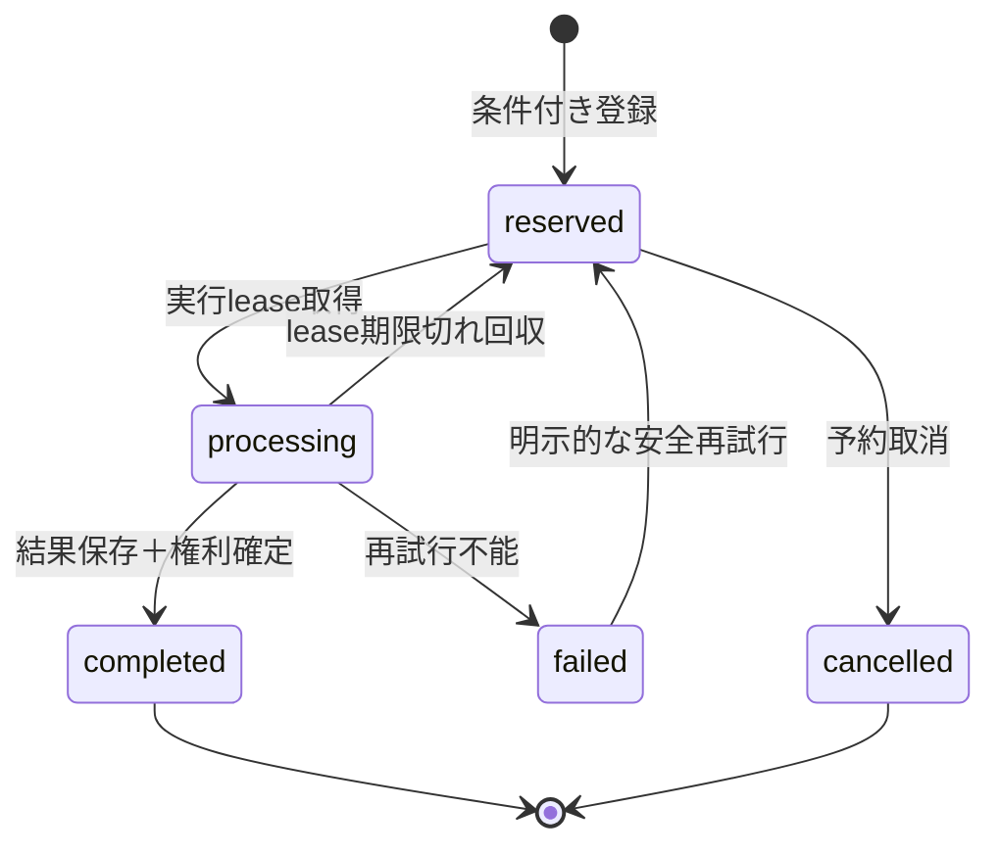

# 鑑定の冪等性とdeep権利トランザクション

## 1. 冪等性キー

- Header：UUID v4の`Idempotency-Key`
- 内部一意性：`HMAC(server_key, user_id + ":" + key)`等の非可逆キー候補
- input hash：正規化済み入力、requestedMode、engine versionからSHA-256を生成
- history_id：サーバー生成UUID。クライアント指定不可
- 保持期間：少なくともクライアント再試行期間とLambda再試行期間を超える期間。具体値は運用・履歴保持方針が未定のため人間判断

同じkeyと同じhashは同じ操作です。同じkeyでhashが異なる場合は409です。

## 2. 状態遷移

既存履歴画面はcompleted、processing、error相当を表示します。`reserved`、`failed`、`cancelled`を同じ履歴テーブルへ追加する影響は未特定です。内部の冪等性テーブルと利用者履歴を分離する案も比較してから決めます。

## 3. 条件付き処理案

1. user_id＋idempotency hashで`attribute_not_exists`条件付き予約。
2. 既存項目ならinput hashを比較。
3. completedなら保存済み結果を返す。
4. processingでlease有効なら409。
5. lease期限切れならowner/version一致の条件付き更新で引き継ぐ。
6. 完了更新は`status=processing AND lease_owner=:owner AND version=:version`条件を付ける。

現在確認できた履歴主キーは`user_id + history_id`です。TransactWriteItemsで別権利項目と原子的に更新できるかは、usersテーブルと将来権利レコードの正式キーが不明なため未確定です。

## 4. deep権利の現状

確認できるのは`deep_enabled` booleanだけです。単発deep残数、期限、予約ID、pending、消費APIは見つかっていません。従って`deep_enabled`を回数制権利として減算してはいけません。

- 月額premium deep：booleanによる利用可否。将来の利用回数制限とは別に扱う。
- 単発deep：保存項目・期限・消費単位・返金条件を新規仕様として人間が決めるまで未実装。

## 5. 消費方式比較

| 方式 | 長所 | 欠点 | 判定 |
|---|---|---|---|
| 開始時即消費 | 単純 | 失敗でも権利喪失 | 不採用 |
| 成功後消費 | 失敗時に減らない | 並列で過剰利用 | 単独では不採用 |
| 開始時予約、成功確定、失敗解放 | 並列と失敗を両立 | 状態・回収処理が必要 | 第一候補 |

## 6. deep予約案

1. サーバーで権利種別（月額boolean／将来の単発残数）を決定。
2. 単発権利の場合、予約ID＝history_id、期限付きで条件付き予約。
3. 生成成功時、履歴completedと予約確定を可能ならTransactWriteItemsで同時実行。
4. 生成失敗時、予約owner一致を条件に解放。
5. タイムアウト予約は期限後に回収ジョブまたは次回要求で解放。
6. 確定済み予約の再確定、解放済み予約の再解放は条件式で拒否し、冪等成功として扱う。

月額boolean権利は残数消費を行わず、生成時点のactive・deep_enabled判定結果を監査記録へ残します。将来回数制にする場合は別移行です。

## 7. 障害復旧

- APIタイムアウト：同じkeyで状態照会し、別keyを発行しない。
- engine失敗：本文をcompletedにせず、予約を解放する。
- 履歴保存失敗：結果を成功レスポンスとして返さない。
- 確定処理の片側成功：トランザクション採用前は本番開放しない。運用補償ツールはrequest_id/history_idだけで再実行可能にする。
- 手動復旧：監査ログと状態レコードを照合し、二人確認で条件付き操作する。本文やtokenを運用ログへコピーしない。
